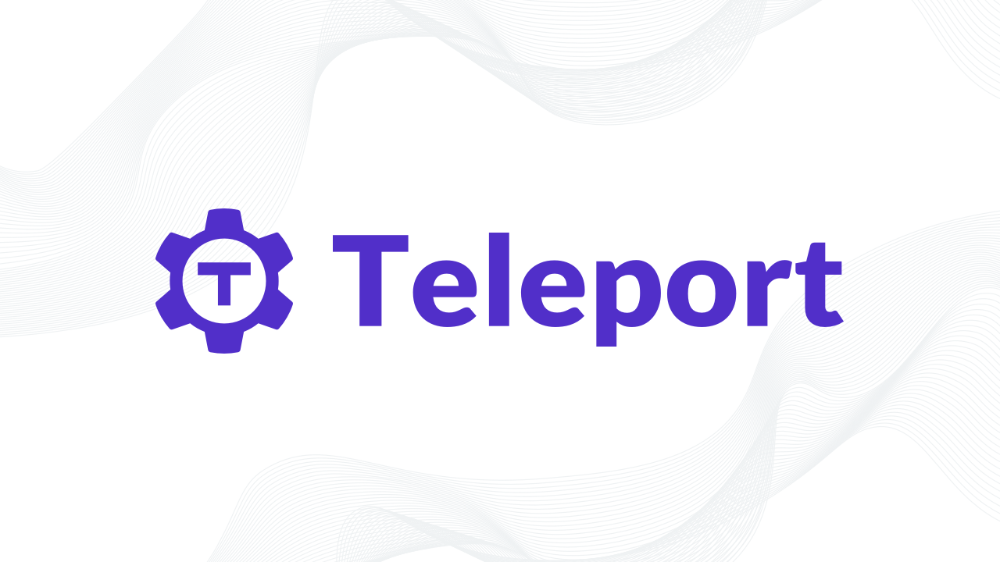

<div align="center">
   
   <div align="center" style="padding: 25px">
      <a href="https://www.apache.org/licenses/LICENSE-2.0">
      
      </a>
   </div>
</div>
</br>

> Read our Blog: <https://goteleport.com/blog/>

> Read our Documentation: <https://goteleport.com/docs/getting-started/>

## Table of Contents

1. [Introduction](#introduction)
1. [Actions](#actions)
1. [Developing](#developing)

## Introduction

`teleport-actions` is a collection of handy GitHub Actions to use within your
workflows when trying to interact with resources protected by Teleport 🚀.

This project is currently experimental and more information about
`teleport-actions` will arrive soon.

## Actions

### `@gravitational/teleport-actions/setup`

`setup` installs key Teleport binaries into your workflow environment, for
example `tctl`, `tsh` and `tbot`. You can then use these within your workflows.

The GitHub Actions tool cache is used by the `setup` action in order to increase
setup speed and reduce bandwidth usage on self-hosted runners.

Pre-requisites:

- A Linux based runner.

Example usage:

```yaml
steps:
  - name: Install Teleport
    uses: gravitational/teleport-actions/setup@v1
    with:
      # version must be specified, and exclude the "v" prefix.
      # check https://goteleport.com/download/ for valid releases.
      version: 11.0.3
```

### `@gravitational/teleport-actions/auth`

`auth` uses Teleport Machine ID to generate a set of credentials which can be
used with other Teleport client tools such as `tsh` and `tctl`.

The action has the following outputs:

- `identity-file`: the path to the identity file which can be used with `tctl` and `tsh`.

Pre-requisites:

- Teleport 11 or above must be used.
- Teleport binaries must already be installed in the job environment.
- You must have created a bot and created a GitHub join token that allows that
  bot to join.
- A Linux based runner.

Example usage:

```yaml
steps:
  - name: Install Teleport
    uses: gravitational/teleport-actions/setup@v1
    with:
      version: 11.0.3
  - name: Authorize against Teleport
    id: auth
    uses: gravitational/teleport-actions/auth@v1
    with:
      # Specify the publically accessible address of your Teleport proxy.
      proxy: tele.example.com:443
      # Specify the name of the join token for your bot.
      token: my-github-join-token
      # Specify the length of time that the generated credentials should be
      # valid for. This is optional and defaults to "1h"
      certificate-ttl: 1h
  - name: List nodes
    run: tsh -i ${{ steps.auth.outputs.identity-file }} --proxy tele.example.com:443 ls
```

### `@gravitational/teleport-actions/auth-k8s`

`auth-k8s` uses Teleport Machine ID to generate an authorized Kubernetes client
configuration for a specified cluster protected by Teleport.

The action sets the `KUBECONFIG` environment variable for consecutive steps in
the job, meaning that tools like `kubectl` will automatically connect to the
requested Kubernetes cluster without additional configuration.

Pre-requisites:

- Teleport 11 or above must be used.
- Teleport binaries must already be installed in the job environment.
- The Kubernetes cluster you wish to access must already be connected to your
  Teleport cluster. See
  <https://goteleport.com/docs/kubernetes-access/getting-started/>
- You must have created a bot with a role with access to your Kubernetes cluster
  and create a GitHub join token that allows that bot to join.
- A Linux based runner.

Example usage:

```yaml
steps:
  - name: Install Kubectl
    uses: azure/setup-kubectl@v3
  - name: Install Teleport
    uses: gravitational/teleport-actions/setup@v1
    with:
      version: 11.0.3
  - name: Authorize against Teleport
    uses: gravitational/teleport-actions/auth-k8s@v1
    with:
      # Specify the publically accessible address of your Teleport proxy.
      proxy: tele.example.com:443
      # Specify the name of the join token for your bot.
      token: my-github-join-token
      # Specify the length of time that the generated credentials should be
      # valid for. This is optional and defaults to "1h"
      certificate-ttl: 1h
      # Specify the name of the Kubernetes cluster you wish to access.
      kubernetes-cluster: my-kubernetes-cluster
  - name: List pods
    run: kubectl get pods
```

## Developing

This guidance applies to engineers wishing to make changes to Teleport's
GitHub actions.

Until we build a CI/CD flow for producing the built actions, we have provided
a series of pre-commit hooks. These will ensure source files follow linter rules
and also ensure that the built version of the action is up to date. Follow the
quick-start instructions at <https://pre-commit.com/#quick-start> to install
the pre-commit hooks.

See the GitHub guidance for versioning:
<https://github.com/actions/toolkit/blob/main/docs/action-versioning.md#recommendations>

In order to allow us to make fixes to older major versions, we maintain a
`branch/v${version}` which will diverge from `main`, with changes backported
from `main` to the appropriate version branch.
